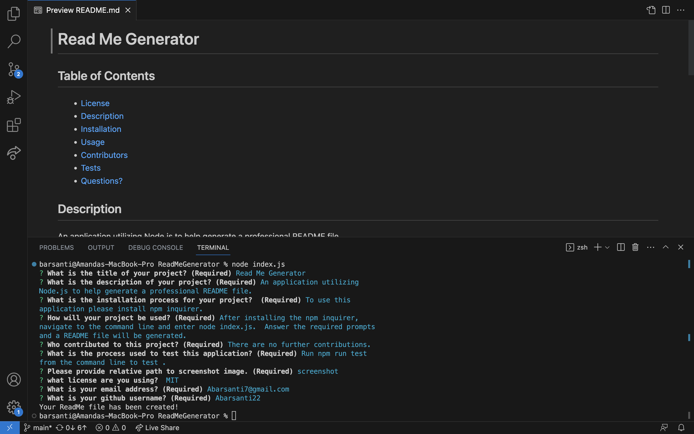

# Read Me Generator
 
   

   ## Table of Contents

   * [License](#license)
   * [Description](#description)
   * [Installation](#installation)
   * [Usage](#usage)
   * [Contributors](#contributors)
   * [Tests](#testing)
   * [Questions?](#questions)
   

  ## Description
  An application utilizing Node.js to help generate a professional README file.
  
  ## Installation
   To use this application please install npm inquirer.
  
  ## Usage
   After installing the npm inquirer, navigate to the command line and enter node index.js. Answer the required prompts and a README file will be generated.
 
  ## Screenshot
  
 
   
  ## Contributors
   There are no further contributions.
     
  ## License
   
    
   Permission to use this application is granted under the MIT license. <https://opensource.org/licenses/MIT>
 

  ## Testing
   Run npm run test from the command line to test .

  ## Questions
GitHub: <a href="github.com:undefined">Abarsanti22</a>

Please email me with any additional questions at <a href="mailto:Abarsanti7@gmail.com">Abarsanti7@gmail.com</a>